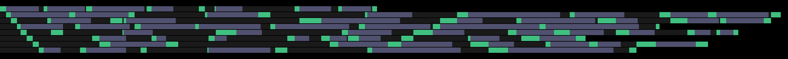
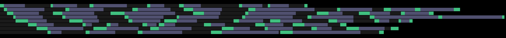
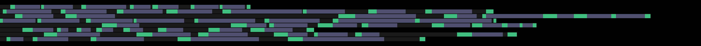

# Multi-Level Feedback Queue (MLFQ) Scheduler Simulation

This project simulates a **Multi-Level Feedback Queue (MLFQ)** scheduler alongside other scheduling algorithms such as **First-Come-First-Serve (FCFS)** and **Shortest Job First (SJF)**. The program evaluates CPU scheduling efficiency by processing multiple sample tasks. This is intended to serve as an educational example.

## How It Works

### Process Loading
Processes are preloaded using the `load_test_processes()` function. Each process has:
- A sequence of CPU burst times
- A sequence of IO burst times
- Metrics such as waiting time, response time, and turnaround time which are calculated dynamically.

### Scheduling Algorithms
1. **First-Come-First-Serve (FCFS)**: Executes processes in the order they arrive.
2. **Shortest Job First (SJF)**: Selects the process with the shortest CPU burst time.
3. **Multi-Level Feedback Queue (MLFQ)**:
   - Implements three levels:
     - **Level 1**: Round Robin with a time quanta of 5 units.
     - **Level 2**: Round Robin with a time quanta of 10 units.
     - **Level 3**: First-Come-First-Serve (FCFS).
   - Processes are downgraded between levels when they fail to complete within their allocated quanta.

### Output
This simulation generates:
- A summary of IO and CPU queues at each time step.
- Logs showing when processes start, end, or transition between levels.
- Performance metrics for all processes, including:
  - Average turnaround time
  - Average waiting time
  - Average response time
  - CPU utilization

---

### Gantt Chart Visualizations

For additional understanding of the process flow, you can view the Gantt charts for the included test cases here:

**MLFQ**:

**FCFS**:

**SJF**:

